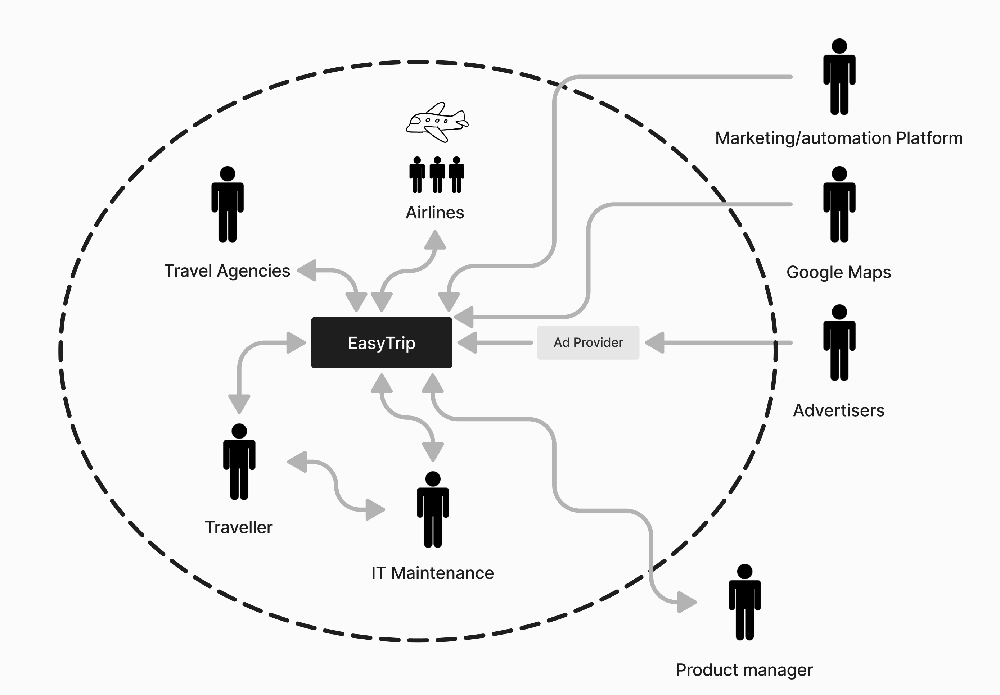

# ETSN15-Software-Requirements-Engineering

## Project Mission v1

1. A product name, different from all other product names in the course.

   - **Product Name:** EasyTrip

2. A short, high-level product description of its background and purpose.

   - **Product Description:** EasyTrip is a comprehensive travel planning tool designed to help travelser find, visualize, and track their trips efficiently. It aims to improve customer satisfaction by providing a comprehensive comparison of flight prices based on different geographic areas.

3. - **User Roles:**
   - **Primary:** Travelers aging from 18-65 y/o.
   - **Secondary:** Family members & friends to to whom booked the trip.
   - **Tertiary:** Travel angencies.

4. - **Team Roles:**
   - **Project Manager:** Felix Sundholm - Project, Process, Prioritization & Release Manager
   - **Stakeholder Manager:** Ossian Gewert
   - **Elicitation Manager:** André Roxhage - Elicitation & Prototyping Manager
   - **Quality Reqirements Manager:** Simon Jacobsson Persson - Quality Requirements Manager
   - **Data Reqirements Manager:** Jacob Jönsson
   - **Validation Manager:** Jonathan Ahlström
   - **Client:** Views project progress and provides feedback on deliverables.
   - **Tools, Documents, experiences and version manager:** All - Tools, Documents, Experiences & Version Manager

5. A brief description of some external system with which your product interacts.
   - **External Systems:**
     - **Trip planning Integration:** Retrieve flight price information and availability from travel agencies such as SAS, Norwegian, etc.
     - **Map Integration:** Sync with Google Maps for retrieving geographical data, including locations, distances, and travel routes.

---

## Requirement Specification

**Two-step approach:** Domain-level + design-level
**Project Type:** Product dev

**Context Diagram:**

- **Users and Systems:**
  - **Primary:** Travelers aging from 18-65 y/o.
  - **Secondary:** Family members & friends to to whom booked the trip.
  - **Tertiary:** Travel angencies.
- **Non-obvious Actors:** Support department (Customer Experience)
- **Stakeholders:** Competitors like Momondo and Flight Scanner, Travel agencies, Ad creators, End users (travelers), product management, development team, airline

### Requirements:\*\* b. Outline a possible requirement for each of the four requirements levels (kap 1.6, goal, domain, etc.)

- **Goal Level Requirement:** Generate revenue through referral links, advertisements, and partnerships with transportation providers.
- **Domain Level Requirement:** Help customers to find cheap travel tickets
  EasyTrip must aggregate and display transportation options with real-time pricing and availability for users.
- **Product Level Requirement:** The system shall allow users to compare transportation options based on cost, travel time, and environmental impact.
  - Membership information storage
  - Visualization of prices
  - Airline info, aggretate data and provide an interactive comparison
- **Design Level Requirement:** The user interface shall include a dynamic filter and sorting feature for transportation options, supporting attributes such as price, duration, layovers, and user preferences.
  - Heatmap to enhanced interactive comparision of prices based on geography. For example by integrating Google Maps API together with flight information from Airlines' APIs.
  - Fast and intuitive user interface
  - Accesible for all user groups. For example, achieved by comprehensive usability evaluations
-
